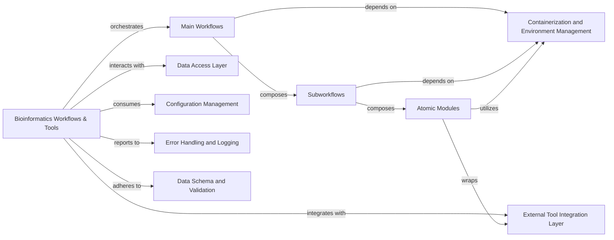

## Details

Overview of the Bioinformatics Workflows & Tools component, detailing its structure, flow, purpose, and interactions with other parts of the system.

### Bioinformatics Workflows & Tools [[Expand]](./Bioinformatics_Workflows_Tools.md)

The top-level component responsible for orchestrating and executing complex bioinformatics pipelines using Nextflow. It acts as the central hub for all genomic data processing, ensuring reproducibility and scalability.

**Related Classes/Methods**:

- `main.nf` (1:1)

- `workflows/` (1:1)

- `subworkflows/` (1:1)

- `modules/` (1:1)

- `genome_manager/Dockerfile` (1:1)

- `genome_manager/env.yaml` (1:1)

### Main Workflows

High-level Nextflow scripts that define complete, end-to-end bioinformatics pipelines for specific use cases (e.g., adding a new genome). They serve as the primary entry points for users to initiate complex operations.

**Related Classes/Methods**:

- `main.nf` (1:1)

- `workflows/add_genome.nf` (1:1)

- `workflows/register_user_defined_gene.nf` (1:1)

- `workflows/update_user_defined_gene.nf` (1:1)

### Subworkflows

Intermediate Nextflow scripts that encapsulate common sequences of atomic modules. They promote code reusability and modularity by breaking down complex main workflows into manageable, logical steps.

**Related Classes/Methods**:

- `subworkflows/prep_genome.nf` (1:1)

- `subworkflows/make_picard_files.nf` (1:1)

- `load_genome_extra_files/subworkflows/load_genome.nf` (1:1)

### Atomic Modules

The smallest, self-contained units of work within the Nextflow ecosystem. Each module typically wraps a single external bioinformatics tool or performs a very specific data manipulation step, ensuring high reusability and testability.

**Related Classes/Methods**:

- `modules/genome_manager/download_genome/download_genome.nf` (1:1)

- `modules/genome_manager/register_genome/register_genome.nf` (1:1)

- `modules/genome_manager/register_gene/register_gene.nf` (1:1)

- `modules/genome_manager/update_gene/update_gene.nf` (1:1)

- `modules/star/genomegenerate/main.nf` (1:1)

- `load_genome_extra_files/modules/custom/gtf2gff3/gtf2gff3.nf` (1:1)

- `modules/unpigz/unpigz.nf` (1:1)

- `modules/gffread/to_transcriptome/main.nf` (1:1)

- `modules/nf-core/custom/dumpsoftwareversions/main.nf` (1:1)

### Containerization and Environment Management

This component defines and manages the isolated execution environments for all bioinformatics tasks. It leverages Docker for containerization and Conda/Mamba (via `env.yaml`) for precise dependency management, ensuring workflow reproducibility and portability across different systems.

**Related Classes/Methods**:

- `genome_manager/Dockerfile` (1:1)

- `genome_manager/env.yaml` (1:1)

### External Tool Integration Layer

Represents the interface and mechanisms through which the Nextflow modules interact with and execute external bioinformatics command-line tools (e.g., STAR, Picard, GFFread).

**Related Classes/Methods**: _None_

### Data Access Layer

Handles the reading and writing of genomic data (e.g., FASTA, GTF, GFF files) and metadata to and from the underlying data storage. Workflows interact with this layer to retrieve input data and persist results.

**Related Classes/Methods**: _None_

### Configuration Management

Manages all configurable parameters for the workflows, including paths to reference data, tool-specific settings, and execution profiles. This ensures flexibility and adaptability of the workflows without modifying source code.

**Related Classes/Methods**: _None_

### Error Handling and Logging

Provides mechanisms for capturing, reporting, and logging errors and execution events from the Nextflow workflows and underlying tools. This is critical for debugging, monitoring, and ensuring the reliability of long-running bioinformatics tasks.

**Related Classes/Methods**: _None_

### Data Schema and Validation

Defines the expected structure and format of input and output data for workflows and modules. It includes mechanisms to validate data against these schemas, ensuring data quality and compatibility throughout the pipeline.

**Related Classes/Methods**: _None_

### [FAQ](https://github.com/CodeBoarding/GeneratedOnBoardings/tree/main?tab=readme-ov-file#faq)