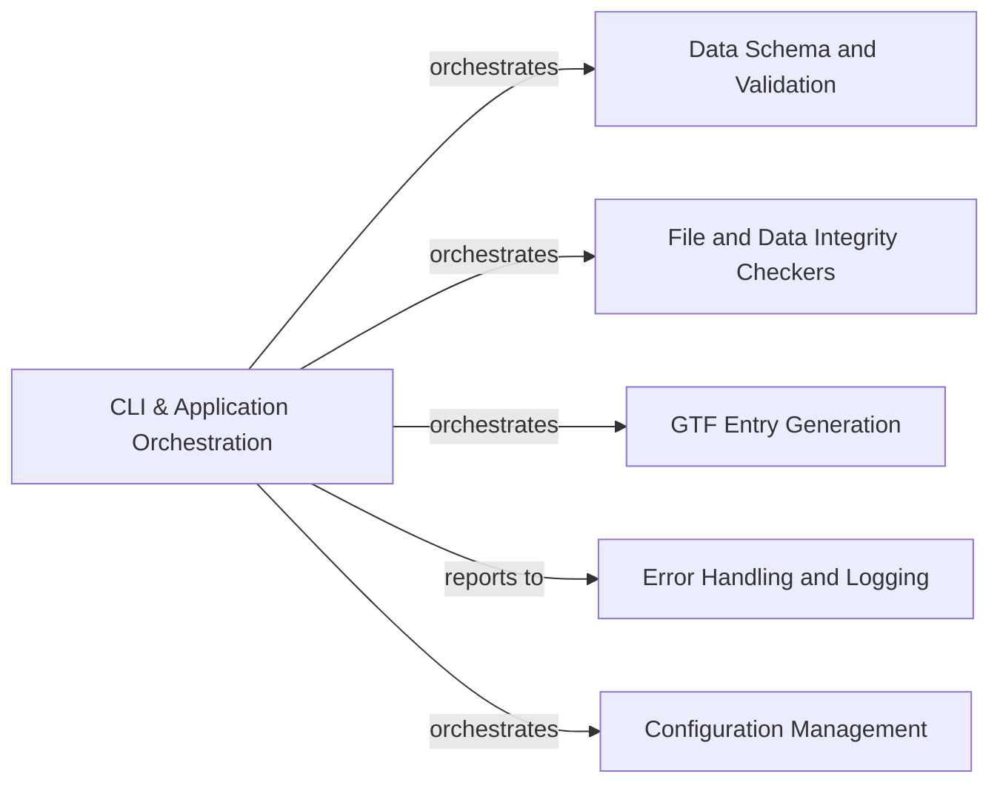

## Details

The `CLI & Application Orchestration` component serves as the primary interface and control center for the genomic data management system. It is responsible for interpreting user commands, validating initial inputs, and directing the flow of execution to either core Python data management functions or Nextflow workflows. This component is fundamental because it provides the user-facing entry point, ensuring that all operations are initiated correctly and routed to the appropriate backend logic, thereby maintaining system integrity and user experience.

### CLI & Application Orchestration [[Expand]](./CLI_Application_Orchestration.md)

This component is the system's command-line interface, built around `argparse` for robust argument parsing. It acts as the central dispatcher, validating user inputs against defined schemas and orchestrating the execution of various data management tasks. These tasks include registering new genomes, listing existing genomic data, generating GTF entries from YAML specifications, and initiating complex Nextflow workflows for data processing. It integrates error handling and logging to provide a resilient and informative user experience.

**Related Classes/Methods**:

- <a href="https://github.com/pfizer-opensource/genome-manager/blob/main/genome_manager/genome_manager.py" target="_blank" rel="noopener noreferrer">`genome_manager.main`</a>

- `argparse.ArgumentParser`

- <a href="https://github.com/pfizer-opensource/genome-manager/blob/main/genome_manager/genome_manager.py#L1232-L1247" target="_blank" rel="noopener noreferrer">`genome_manager.register_genome` (1232:1247)</a>

- <a href="https://github.com/pfizer-opensource/genome-manager/blob/main/genome_manager/genome_manager.py#L1561-L1609" target="_blank" rel="noopener noreferrer">`genome_manager.list_genomes` (1561:1609)</a>

- <a href="https://github.com/pfizer-opensource/genome-manager/blob/main/genome_manager/generate_gtf_entry.py" target="_blank" rel="noopener noreferrer">`genome_manager.generate_gtf_entry.generate_gtf_entry_from_yaml`</a>

### Data Schema and Validation

Handles data validation using Pydantic schemas.

**Related Classes/Methods**:

- `Pydantic.GenomeFile`

- `Pydantic.GenomeMetadata`

- `Pydantic.YamlGeneModel`

- `Pydantic.YamlGeneCollection`

### File and Data Integrity Checkers

Ensures the validity and integrity of files and data.

**Related Classes/Methods**:

- `GenomeFile.checksum_validation`

- `globber`

### GTF Entry Generation

Converts YAML gene models into GTF format.

**Related Classes/Methods**:

- <a href="https://github.com/pfizer-opensource/genome-manager/blob/main/genome_manager/generate_gtf_entry.py" target="_blank" rel="noopener noreferrer">`genome_manager.generate_gtf_entry.generate_gtf_entry_from_yaml`</a>

### Error Handling and Logging

Manages error reporting and system logging.

**Related Classes/Methods**:

- `logging`

- `logging.logger.info`

- `logging.logger.exception`

### Configuration Management

Handles loading and interpreting system configuration.

**Related Classes/Methods**:

- <a href="https://github.com/pfizer-opensource/genome-manager/blob/main/genome_manager/genome_manager.py#L622-L627" target="_blank" rel="noopener noreferrer">`genome_manager.load_mount_config` (622:627)</a>

- <a href="https://github.com/pfizer-opensource/genome-manager/blob/main/genome_manager/genome_manager.py#L512-L527" target="_blank" rel="noopener noreferrer">`genome_manager.find_active_system` (512:527)</a>

### [FAQ](https://github.com/CodeBoarding/GeneratedOnBoardings/tree/main?tab=readme-ov-file#faq)