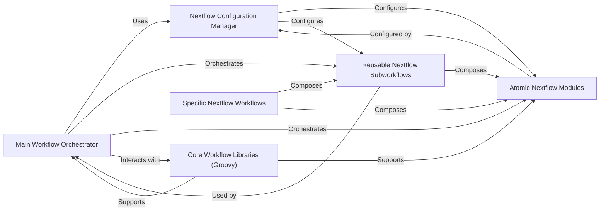

## Details

Abstract Components Overview

### Main Workflow Orchestrator

This is the entry point and primary control flow for the entire Nextflow pipeline. It defines the high-level sequence of operations, orchestrating the execution of various subworkflows and individual modules to achieve the overall pipeline objective. It acts as the central coordinator, ensuring processes run in the correct order and dependencies are met.

**Related Classes/Methods**:

- `main.nf` (1:1)

### Nextflow Configuration Manager

This component is responsible for managing all execution-related parameters, resource allocations, and environment settings for the Nextflow pipeline. It consolidates configurations from `nextflow.config` (global settings), `conf/modules.config` (module-specific overrides), and `conf/profiles.config` (environment-specific profiles like Docker, Conda, HPC clusters). This ensures reproducibility and adaptability across different execution environments.

**Related Classes/Methods**:

- `nextflow.config` (1:1)

- `modules.config` (1:1)

- `profiles.config` (1:1)

### Core Workflow Libraries (Groovy)

These Groovy scripts provide reusable helper functions, complex data manipulation logic, or utility classes that extend the capabilities of the Nextflow DSL. They encapsulate common, non-pipeline-specific logic that can be invoked by various Nextflow processes or workflows, promoting code reuse and separation of concerns.

**Related Classes/Methods**:

- `WorkflowMain.groovy` (1:1)

- `WorkflowAddGenome.groovy` (1:1)

### Atomic Nextflow Modules

These are the smallest, self-contained units of work within the Nextflow ecosystem. Each module typically encapsulates a single bioinformatics tool or a specific, atomic processing step (e.g., `bwa_index`, `samtools_sort`). They are designed to be highly reusable and independent, taking specific inputs and producing specific outputs.

**Related Classes/Methods**:

- `modules/custom/*/*.nf` (1:1)

- `modules/genome_manager/*/*.nf` (1:1)

- `load_genome_extra_files/modules/custom/*.nf` (1:1)

### Reusable Nextflow Subworkflows

Subworkflows combine multiple atomic modules into a larger, logical sequence of operations that can be reused across different main workflows. They represent common patterns or multi-step processes (e.g., "align and sort reads," "perform variant calling"). This abstraction reduces redundancy and improves pipeline readability.

**Related Classes/Methods**:

- `subworkflows/*.nf` (1:1)

- `load_genome_extra_files/subworkflows/load_genome.nf` (1:1)

### Specific Nextflow Workflows

These are complete, end-to-end pipelines tailored for specific use cases or analyses within the Genomic Reference Data Hub. They typically integrate various subworkflows and atomic modules, often defined in the `workflows/` directory, to achieve a particular biological or genomic objective.

**Related Classes/Methods**:

- `workflows/*.nf` (1:1)

### [FAQ](https://github.com/CodeBoarding/GeneratedOnBoardings/tree/main?tab=readme-ov-file#faq)