```mermaid

graph LR

    CLI_Application_Orchestration["CLI & Application Orchestration"]

    Genome_Data_Management_Core["Genome Data Management Core"]

    Data_Schema_Registry["Data Schema & Registry"]

    Nextflow_Workflow_Engine["Nextflow Workflow Engine"]

    Bioinformatics_Workflows_Tools["Bioinformatics Workflows & Tools"]

    CLI_Application_Orchestration -- "Invokes/Triggers" --> Genome_Data_Management_Core

    CLI_Application_Orchestration -- "Invokes/Triggers" --> Nextflow_Workflow_Engine

    Genome_Data_Management_Core -- "Provides Data/Status to" --> CLI_Application_Orchestration

    Genome_Data_Management_Core -- "Uses/Validates with" --> Data_Schema_Registry

    Genome_Data_Management_Core -- "Prepares Data for" --> Nextflow_Workflow_Engine

    Data_Schema_Registry -- "Defines/Validates" --> Genome_Data_Management_Core

    Data_Schema_Registry -- "Provides Configuration/Schema to" --> Nextflow_Workflow_Engine

    Data_Schema_Registry -- "Stores/Retrieves" --> Bioinformatics_Workflows_Tools

    Nextflow_Workflow_Engine -- "Reports Status to" --> CLI_Application_Orchestration

    Nextflow_Workflow_Engine -- "Orchestrates/Executes" --> Bioinformatics_Workflows_Tools

    Nextflow_Workflow_Engine -- "Reads Configuration from" --> Data_Schema_Registry

    Bioinformatics_Workflows_Tools -- "Executed by" --> Nextflow_Workflow_Engine

    Bioinformatics_Workflows_Tools -- "Accesses/Stores Data in" --> Data_Schema_Registry

    click CLI_Application_Orchestration href "https://github.com/pfizer-opensource/genome-manager/blob/main/.codeboarding//CLI_Application_Orchestration.md" "Details"

    click Genome_Data_Management_Core href "https://github.com/pfizer-opensource/genome-manager/blob/main/.codeboarding//Genome_Data_Management_Core.md" "Details"

    click Nextflow_Workflow_Engine href "https://github.com/pfizer-opensource/genome-manager/blob/main/.codeboarding//Nextflow_Workflow_Engine.md" "Details"

    click Bioinformatics_Workflows_Tools href "https://github.com/pfizer-opensource/genome-manager/blob/main/.codeboarding//Bioinformatics_Workflows_Tools.md" "Details"

```

## Details

The `genome-manager` project is architected as a robust Bioinformatics Data Management System with integrated workflow automation. The system is designed for clear separation of concerns, modularity, and reproducibility, leveraging Python for core data management and Nextflow for complex bioinformatics workflows.

### CLI & Application Orchestration [[Expand]](./CLI_Application_Orchestration.md)

The primary user interface, responsible for parsing command-line arguments, validating initial input, and orchestrating the execution of either core Python data management functions or Nextflow workflows. It acts as the central dispatcher for user commands.

**Related Classes/Methods**:

- <a href="https://github.com/pfizer-opensource/genome-manager/blob/main/genome_manager/genome_manager.py#L1-L1" target="_blank" rel="noopener noreferrer">`genome_manager.py` (1:1)</a>

### Genome Data Management Core [[Expand]](./Genome_Data_Management_Core.md)

Encapsulates the core business logic for managing genomic and gene metadata. This includes operations like reading, writing, and updating genome and gene registry files (JSON/YAML), performing data integrity checks, and preparing data structures for downstream processing. It also includes Python utilities for data transformation.

**Related Classes/Methods**:

- <a href="https://github.com/pfizer-opensource/genome-manager/blob/main/genome_manager/genome_manager.py#L1-L1" target="_blank" rel="noopener noreferrer">`genome_manager.py` (1:1)</a>

- <a href="https://github.com/pfizer-opensource/genome-manager/blob/main/genome_manager/generate_gtf_entry.py#L1-L1" target="_blank" rel="noopener noreferrer">`generate_gtf_entry.py` (1:1)</a>

### Data Schema & Registry

Defines and enforces the structural integrity and validation rules for all managed data, including genome assemblies, associated files, gene models, and Nextflow pipeline parameters. It also manages the physical storage and organization of all genomic data files and internal configuration registries.

**Related Classes/Methods**:

- <a href="https://github.com/pfizer-opensource/genome-manager/blob/main/genome_manager/genome_manager.py#L1-L1" target="_blank" rel="noopener noreferrer">`genome_manager.py` (1:1)</a>

- `nextflow_schema.json` (1:1)

- `NfcoreSchema.groovy` (1:1)

- `modules.config` (1:1)

- `profiles.config` (1:1)

### Nextflow Workflow Engine [[Expand]](./Nextflow_Workflow_Engine.md)

The central orchestration component for complex bioinformatics pipelines. It interprets and executes Nextflow scripts, manages process dependencies, handles resource allocation, and integrates various modules and subworkflows to perform multi-step tasks. It also reads and applies pipeline configurations.

**Related Classes/Methods**:

- `main.nf` (1:1)

- `WorkflowMain.groovy` (1:1)

- `WorkflowAddGenome.groovy` (1:1)

- `nextflow.config` (1:1)

- `modules.config` (1:1)

- `profiles.config` (1:1)

### Bioinformatics Workflows & Tools [[Expand]](./Bioinformatics_Workflows_Tools.md)

Provides reusable, atomic units of bioinformatics processing logic (modules) and combinations of modules for common patterns (subworkflows). These perform specific, granular tasks like downloading files, generating genome indices, or converting file formats, often leveraging containerized external bioinformatics tools.

**Related Classes/Methods**:

- `add_genome.nf` (1:1)

- `register_user_defined_gene.nf` (1:1)

- `update_user_defined_gene.nf` (1:1)

- `download_genome.nf` (1:1)

- `register_genome.nf` (1:1)

- `main.nf` (1:1)

- `gtf2gff3.nf` (1:1)

- `prep_genome.nf` (1:1)

- `load_genome.nf` (1:1)

- `Dockerfile` (1:1)

- `env` (1:1)

### [FAQ](https://github.com/CodeBoarding/GeneratedOnBoardings/tree/main?tab=readme-ov-file#faq)